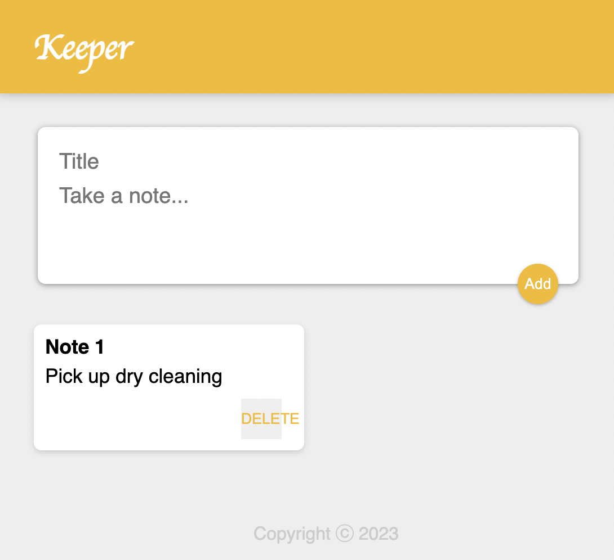

# Keeper Web Application



A web application built with Next.js for creating and managing notes, simulating a note-taking app. The application allows users to add and delete notes with an intuitive user interface.

## Features

- Add new notes with a title and content.
- Delete notes when they are no longer needed.
- Clean and user-friendly interface.
- Global CSS styling for a consistent look and feel.

## Technologies Used

- [Next.js](https://nextjs.org/)
- [React](https://reactjs.org/)
- [CSS](https://developer.mozilla.org/en-US/docs/Web/CSS)

## Getting Started

To get started with this project, follow these steps:

1. **Clone the repository** to your local machine:

   ```bash
   git clone https://github.com/RudyTheCoder/keeper.git
   ```

2. **Install dependencies:**
   npm install
   or
   yarn install

3. **Run the development server:**
   npm run dev
   or
   yarn dev

5. Open your web browser and access the application at http://localhost:3000.

## Contributing

Contributions are welcome! If you'd like to contribute to this project, please follow these steps:

1. Fork the repository.
2. Create a new branch for your feature or bug fix: git checkout -b feature-name.
3. Make your changes and commit them: git commit -m 'Add feature-name'.
4. Push to the branch: git push origin feature-name.
5. Submit a pull request to the main branch of the original repository.

## Credits

Created by Rudy Aldana. Inspired by the Udemy Full Stack Web Development Course by Angela Yu.
